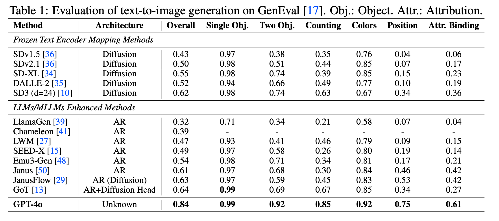
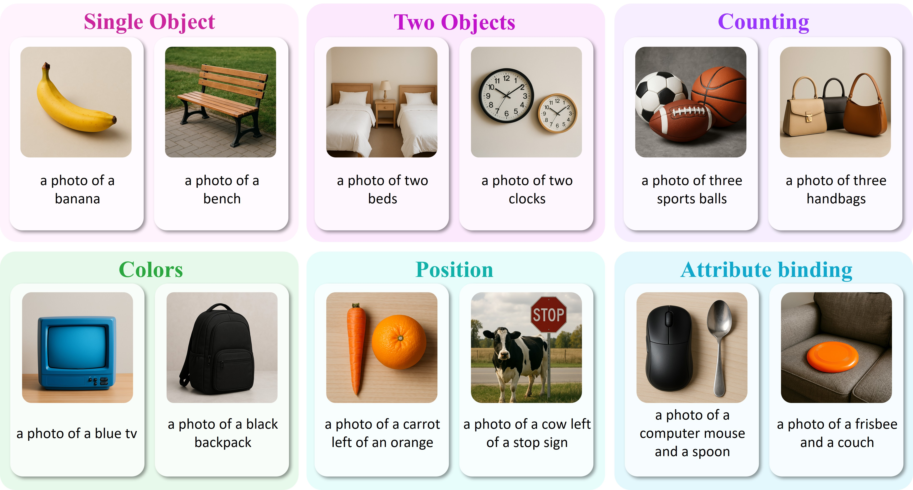
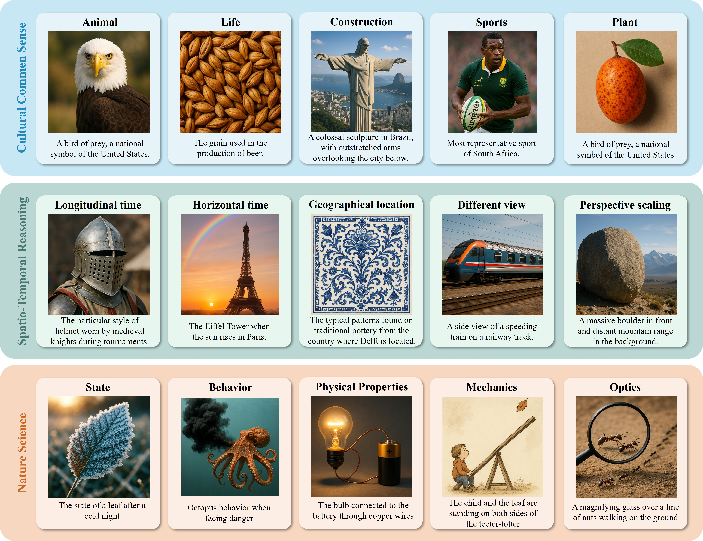
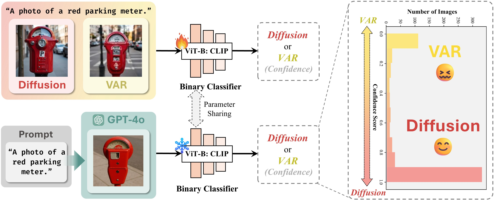

# GPT-ImgEval: A Comprehensive Benchmark for Diagnosing GPT4o in Image Generation


## 📰 News

* **[2025.4.3]**  🔥 We have released **GPT-ImgEval: A Comprehensive Benchmark forDiagnosing GPT4o in Image Generation**. Check out the [paper](https://arxiv.org/pdf/2504.02782). The code and dataset are coming soon

## 🏆 Contributions

**GPT-4o image generation evaluation：** The first benchmark to quantitatively and qualitatively evaluate GPT-4o’s image generation capabilities across three well-established benchmarks, including text-to-image generation（GenEval）, editing（Reason-Edit）, and world knowledge-informed semantic generation（WISE）. Our compre-hensive results highlight the superior image generation and comprehension capabilities of GPT4o over previous models.

**Generate Architecture Analysis：** Based on the benchmark results, we conducted an in-depth analysis of the potential underlying architecture of GPT-4o. Through classifier-based image analysis investigation, we confirmed that the decoder is most likely a Diffusion architecture and gave a potential Encoder paradigm speculation.

**More detailed analysis：** We present a detailed analysis of GPT-4o generation results and a systematic empirical study of its weaknesses, including common failure modes and generation artifacts.We further provide a comparative study of multi-round image editing capabilities between GPT-4o and Gemini 2.0 Flash. Additionally, we explore the AIGC safety issue by assessing the detectability of GPT-4o-generated images using existing SOTA image forensic models.

## 🤗 Dataset Download

We will upload our GPT-4o-based image synthesis results to Huggingface soon.

We will also upload our automated script within these two days to facilitate more people to evaluate GPT-4o's image synthesis capabilities.

## 🔥Evaluation results

According to the table, GPT4o achieves the highest overall score of 0.84, largely outperforming both the frozen text encoder methods and the LLM/MLLM-enhanced approaches. 



Figure presents qualitative examples of GPT-4o’s compositional text-to-image generation capabilities across six core evaluation categories in the GenEval benchmark.


As shown in the bar chart , GPT-4o significantly outperforms all existing image editing methods on the Reason-Edit bench-mark, achieving a remarkable score of 0.929. This represents a substantial leap of +0.357 over the best-performing method prior to 2025 (SmartEdit, 0.572), highlighting the model’s powerful instruction-following ability and fine-grained editing control.


GPT-4o significantly outperforms existingspecialized T2I generation methods and unified MLLM-based approaches in terms of overall WiScore. GPT-4o combines exceptional world knowledge understanding with high-fidelity image generation, demonstrating a dual strength in multimodal generation tasks.




## 🤔Generate Architecture

Beyond benchmark evaluations, we conduct deeper analyses to uncover GPT-4o’s potential architectural choices. Specifically, we first explore whether GPT-4o relies on a diffusion-based or autoregressive decoder head. To this end, we propose a model-based classification method, where a standard binary classifier is trained to distinguish between images generated by the two paradigms, and then applied to GPT-4o’s outputs. Interestingly, the classifier consistently classi-fies GPT-4o’s images as diffusion-based, providing empirical evidence that GPT-4o may internally use a diffusion head for image decoding. 




## ❤️ BibTeX 

```
soon

```


