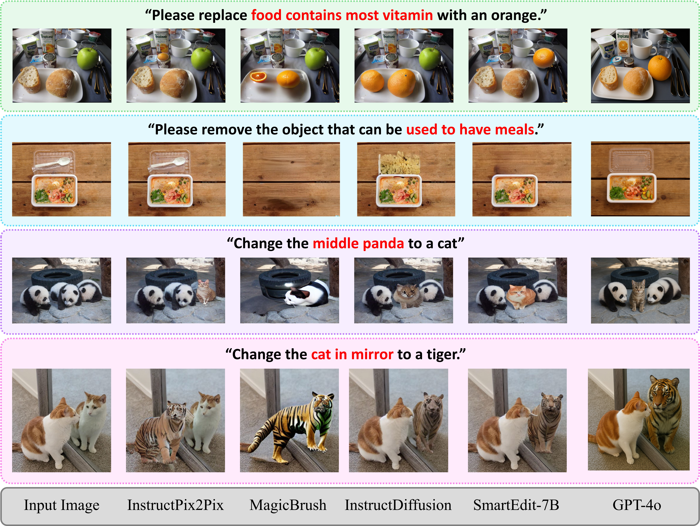
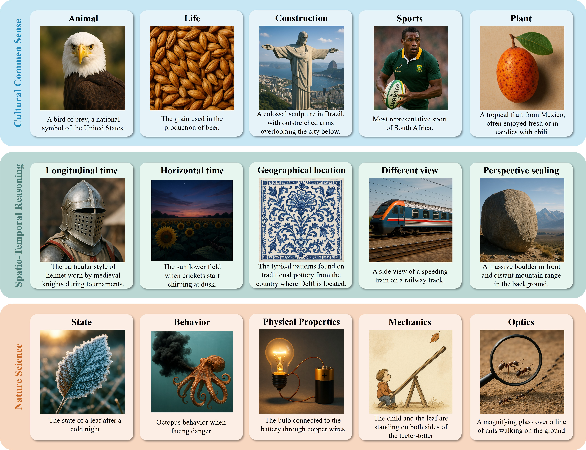
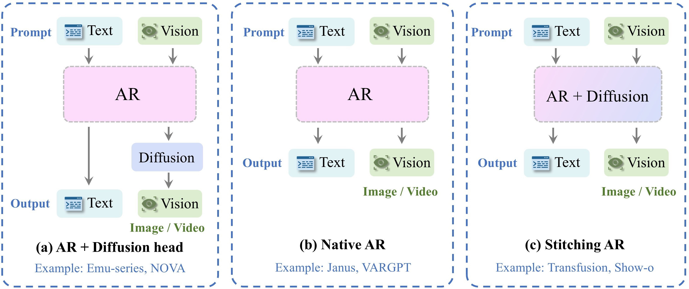

# GPT-ImgEval: A Comprehensive Benchmark for Diagnosing GPT4o in Image Generation

<a href="https://arxiv.org/abs/2504.02782" target="_blank"></a>
<a href='https://huggingface.co/datasets/Yejy53/GPT-ImgEval'></a>


## 📰 News

* **[2025.4.3]**  🔥 We have released **GPT-ImgEval: A Comprehensive Benchmark forDiagnosing GPT4o in Image Generation**. Check out the [paper](https://arxiv.org/pdf/2504.02782). The code and dataset are coming soon.

## 🏆 Contributions

* **GPT-4o Image Generation Evaluation:** GPT-4o excels in image generation, surpassing previous models across benchmarks like text-to-image (GenEval), editing (Reason-Edit), and world knowledge-informed generation (WISE).
* **Architecture Analysis:** Our analysis suggests GPT-4o uses a Diffusion architecture for its decoder, with a potential speculative model for its encoder.
* **Detailed Analysis:** We explore GPT-4o’s generation strengths and weaknesses, compare its multi-round editing capabilities with Gemini 2.0 Flash, and assess image detectability for safety.


## 💻 Auto-Script

The script supports **text-only** and **text+image** inputs, and it also supports automatically **saving the output images** and **response results**.

### Prerequisites

* macOS with M1/M2/M3/M4 chip
* [ChatGPT desktop app](https://chatgpt.com/download) installed

### Usage

* Since the window positions may vary for different users, it is recommended to first **obtain the approximate position** where the image appears, and then modify the obtained **x and y coordinates** in the *config.json* file to ensure proper functionality.

( Input an example in a window and use ***get_position.py*** to get the approximate position where the image appears. For more accurate positioning, we recommend scrolling the interface to the very bottom. The scroll parameters can also be set in the scroll_amount field of the *config.json* file. )

```bash
python get_position.py
```

* After modifying the *config.json*, you can run our sample code to try out the features of our script.

```bash
# text-only example
python chatgpt_script.py --config_path example/text-only

# text-image example 
# Please change the image_folder parameter in the config.json file under the example/text-image folder to the absolute path on your computer.
python chatgpt_script.py --config_path example/text-image
```

### Troubleshooting

If the tool isn't functioning correctly:

* Make sure ChatGPT app is installed and you're logged in.
* Verify that all required permissions have been granted.
* Make sure your current input method is set to English.
* Make sure the path of the image folder is an absolute path (using a relative path often leads to image input errors).

## 🤗 Dataset Download

We uploaded the GPT generation results for the Reason-Edit and GenEval datasets, which can be downloaded 📁 [here](https://github.com/PicoTrex/GPT-ImgEval).

We will also upload our automated script within these two days to facilitate more people to evaluate GPT-4o's image synthesis capabilities.



## 🔥 Evaluation results

According to the table, GPT4o achieves the highest overall score of 0.84, largely outperforming both the frozen text encoder methods and the LLM/MLLM-enhanced approaches. 


Figure presents qualitative examples of GPT-4o's compositional text-to-image generation capabilities across six core evaluation categories in the GenEval benchmark.


As shown in the bar chart , GPT-4o significantly outperforms all existing image editing methods on the Reason-Edit bench-mark, achieving a remarkable score of **0.929**. This represents a substantial leap of **+0.357** over the best-performing method prior to 2025 (SmartEdit, **0.572**), highlighting the model’s powerful instruction-following ability and fine-grained editing control.


GPT-4o significantly outperforms existingspecialized T2I generation methods and unified MLLM-based approaches in terms of overall WiScore. GPT-4o combines exceptional world knowledge understanding with high-fidelity image generation, demonstrating a dual strength in multimodal generation tasks.



## 🤔 Generate Architecture

Beyond benchmark evaluations, we conduct deeper analyses to uncover GPT-4o's potential architectural choices. Specifically, we first explore whether GPT-4o relies on a diffusion-based or autoregressive decoder head. To this end, we propose a model-based classification method, where a standard binary classifier is trained to distinguish between images generated by the two paradigms, and then applied to GPT-4o's outputs. Interestingly, the classifier consistently classi-fies GPT-4o's images as diffusion-based, providing empirical evidence that GPT-4o may internally use a diffusion head for image decoding.



## ❤️ Acknowledgements

We would like to thank the following open-source projects and research works :

* [GenEval](https://github.com/djghosh13/geneval)
* [SmartEdit](https://github.com/TencentARC/SmartEdit)
* [WISE](https://github.com/PKU-YuanGroup/WISE)
* [c(laude-chatgpt-mcp](https://github.com/syedazharmbnr1/claude-chatgpt-mcp)
* [LLM-DepthEval](https://github.com/JiahaoZhang-Public/LLM-DepthEval)
* [awesome-framework-gallery](https://github.com/LongHZ140516/awesome-framework-gallery) 


## 📕 BibTeX 

```bib
@article{yan2025gpt-imgeval,
      title={GPT-ImgEval: A Comprehensive Benchmark for Diagnosing GPT4o in Image Generation}, 
      author={Zhiyuan Yan and Junyan Ye and Weijia Li and Zilong Huang and Shenghai Yuan and Xiangyang He and Kaiqing Lin and Jun He and Conghui He and Li Yuan},
      journal={arXiv preprint arXiv:2504.02782},
      year={2025},
}
```